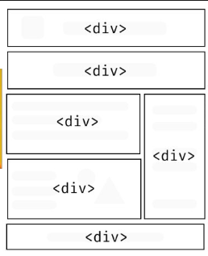
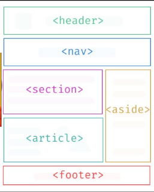

## HTML Semântico

### O que é?

o **HTML Semântico** é uma forma de estruturação do HTML para melhor entendimento e leitura para robos ou humanos.

```
<body>                           <body>
    <div>...</div>                  <header></header>
    <div>...</div>                  <main></main>
    <div>...</div>                  <footer></footer>
</body>                          </body>
```

### Sem semantica


### Com semantica
